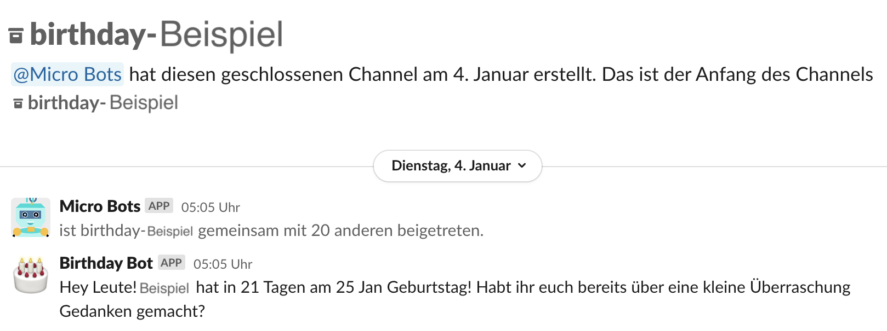

## About the Birthday Bot :birthday:

This bot opens a slack channel a few weeks before an employee's birthday with all other newcubator employees. This way we do not forget
birthdays and have enough time to think about presents. The bot also reminds us on the birthday to congratulate the birthday child and
archives the channel on the following workday.

This can look like this, for example:

## Prerequisites

- create a [slack app](https://api.slack.com/authentication/basics) and get the SLACK_TOKEN
- get your [MOCO_TOKEN](https://www.mocoapp.com/funktionen/20-connect/inhalt/52-schnittstellen)
- add the tokens to the environment variables in Gitlab (Settings > CI/CD > Variables).
- change the [MOCO_URL](https://gitlab.com/newcubator/micro-bots/-/blob/main/src/functions/birthday.ts) to the URL of your company.

## How it works

The birthday bot runs every day at 4:05 AM (UTC). It loads the data from moco, processes it, and uploads it to slack.

You can easily modify time by changing the execution time of the [AWS EventBridge](https://docs.aws.amazon.com/eventbridge/) in the serverless.yml [here](https://gitlab.com/newcubator/micro-bots/-/blob/main/serverless.yml).
There you can also adjust `LEAD_TIME`, which is the time in advance when it opens the channel (currently it is 21 days).
