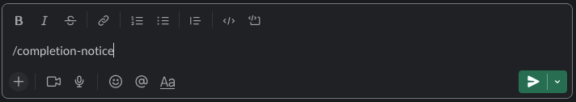
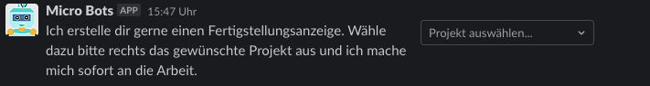

# About the Project Completion Notice Bot

A Slack Slash Command that makes it easy to generate project completion notices. You can send these to the client. After calling the command `/completion-notice`, you can interactively enter the remaining needed information. You will receive the final PDF in the slack thread of the command.

## Prerequisites

- create a [slack app](https://api.slack.com/authentication/basics)
- add the completion-notice [Slash Command](https://api.slack.com/interactivity/slash-commands) to your app
- get the SLACK_TOKEN
- get your [MOCO_TOKEN](https://www.mocoapp.com/funktionen/20-connect/inhalt/52-schnittstellen)
- add the tokens to the environment variables in Gitlab (Settings > CI/CD > Variables).

## Technical Flow

[](https://mermaid.live/edit#pako:eNqNkc1qwzAQhF9l2XPyAjoESp3SSyFgSi-6LNI2Ua2fVJJTQsi7V3JtN4ZQKtBl9puZhb2gCppRYOLPnr3ixtA-kgPpAVpLqgNYbzaggnPk9XP5lqOoo3SAxx-1sksA1tU0-AW8cEq0Z9jF8MFdhiaGow5f_reiwsZnjqSyOZl8nnsmFlq2XIZhcM3vnmlI4xP7PKc8vLWwrcr_zOPer0dNmaf1pb_P3xhq-m3xMswG0rBrnv6mlpWVxRU6jo6MLme6VEViPrBjiaUSNcVOovTXwvWDfatNDhHFO9nEK6Q-h_bsFYoce56g8c4jdf0GCu-w0A)

Slack only gives 3 seconds for handling interactions, that's why we decoupled the information gathering and generation of the PDF with Amazon EventBridge.

This implementation uses [Slack user interactions](https://api.slack.com/interactivity/handling). For this only one endpoint for all implementations can be configured. We use our Slack-Interaction-Handler for the [Completion Notice](completionNotice.md)-, [lock](lock-project.md)- and [unlock](lock-project.md)-bot.

## How to Use

To use the completion notice bot, just type /completion-notice in any chat.

```
/completion-notice
```


Then select the project for which you want to create the completion notice from the drop-down menu.



The bot gives you feedback that it is creating the completion notice:



Then the bot will reply in the thread with the completion notice as a PDF to download, just like this:


