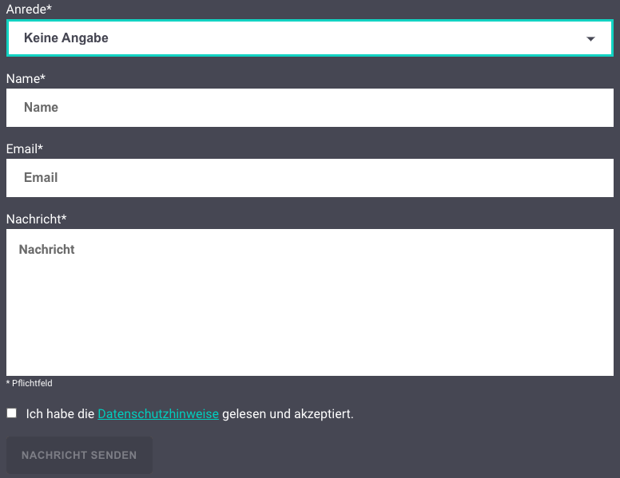

# Contact Request

The contact request bot sends an email to the newcubator info mail with the information of the contact form on the homepage.

In order to be able to use the contact request bot, you will of course have to adjust the email and url [here](https://gitlab.com/newcubator/micro-bots/-/blob/main/src/functions/contact-request.ts).

