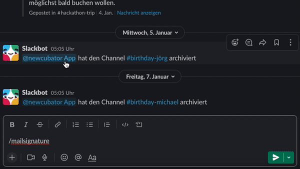

## About the Mail Signature Bot :email:

This bot can be invoked from Slack returning you a personalized mail signature that you can use in your mails.

### Prerequisites

- create a [slack app](https://api.slack.com/authentication/basics)
- add the mail-signature [Slash Command](https://api.slack.com/interactivity/slash-commands) to your app
- get the SLACK_TOKEN
- get your MOCO_TOKEN (each user can find their user-specific key on mocoapp.com on their profile in the "Integrations" tab.). For more information about the MOCO api click [here](https://github.com/hundertzehn/mocoapp-api-docs).
- add the keys to the environment variables in Gitlab (Settings > CI/CD > Variables).

### How to Use

To use the mail-signature bot, just type /mail-signature in any chat.

```
/mail-signature
```

This could look like this, for example:



### How it works

The mail signature bot is divided into two functions. The first is the [mail-signature](https://gitlab.com/newcubator/micro-bots/-/blob/main/src/functions/mail-signature.ts), which is basically just the slack command to create a link to the generated signature.
The second function is the [mail-signature-generator](https://gitlab.com/newcubator/micro-bots/-/blob/main/src/functions/mail-signature-generator.ts). This function takes the information about the user from Slack, then queries the corresponding data from MOCO, and processes it into a mail signature.

If you want to use the bot for your own company, you must of course change the corresponding data, such as the address or the logo in the [mail-signature-generator](https://gitlab.com/newcubator/micro-bots/-/blob/main/src/functions/mail-signature-generator.ts) function.
