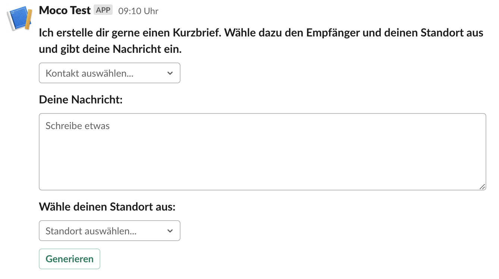

## About the shortmail bot :mailbox_with_mail:

The shortmail bot is a slack command that can be used to create a short mail. Sometimes you have to write a short letter, and this bot is ideal for optimising and shortening this process. The output is a nicely formatted letter addressed to a moco contact of your choice, with yourself as the sender.

## Prerequisites

- create a [slack app](https://api.slack.com/authentication/basics)
- add the shortmail [Slash Command](https://api.slack.com/interactivity/slash-commands) to your app
- get the SLACK_TOKEN
- get your MOCO_TOKEN (each user can find their user-specific key on mocoapp.com on their profile in the "Integrations" tab.). For more information about the MOCO api click [here](https://github.com/hundertzehn/mocoapp-api-docs).
- add the keys to the environment variables in Gitlab (Settings > CI/CD > Variables).

This implementation uses [Slack user interactions](https://api.slack.com/interactivity/handling). For this only one endpoint for all implementations can be configured. We use our Slack-Interaction-Handler for the [Short Mail](shortmail.md)-, [Completion Notice](completionNotice.md)-, [lock](lock-project.md)- and [unlock](lock-project.md)-bot.

## How to Use

To use the shortmail bot, just type /shortmail in any public chat.

General syntax:

```
/shortmail
```

You can then select the recipient from a drop-down menu, enter your message in a text field and specify your location (as the sending location).



The bot gives you feedback that it is creating the short mail:


Then the bot will reply in the thread with the short mail as a PDF to download.

##Configuration

To change the layout in the background of the letter, you must place a PDF file in the shortmail/templates folder. It is important that you convert it to base64 format beforehand.
