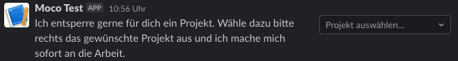

## About the unlock-project bot :unlock:

The unlock-project bot is a slack command that can be used to re-open a closed MOCO project. From this point on, all the employees can enter their working hours on the corresponding project again.

## Prerequisites

- create a [slack app](https://api.slack.com/authentication/basics)
- add the unlock-project [Slash Command](https://api.slack.com/interactivity/slash-commands) to your app
- get the SLACK_TOKEN
- get your MOCO_TOKEN (each user can find their user-specific key on mocoapp.com on their profile in the "Integrations" tab.). For more information about the MOCO api click [here](https://github.com/hundertzehn/mocoapp-api-docs).
- add the keys to the environment variables in Gitlab (Settings > CI/CD > Variables).

This implementation uses [Slack user interactions](https://api.slack.com/interactivity/handling). For this only one endpoint for all implementations can be configured. We use our Slack-Interaction-Handler for the [Short Mail](shortmail.md)-, [Completion Notice](completionNotice.md)-, [lock](lock-project.md)- and [unlock](lock-project.md)-bot.

## How to Use

To use the unlock-project bot, just type /unlock-project in any chat.

General syntax:

```
/unlock-project
```

Then select the project which you want to unlock from the drop-down menu.



The bot gives you feedback that the project is unlocked.


