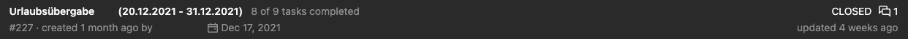

## About the Vacation Handover Bot

To help us keep things running smoothly, the vacation handover bot always reminds us when a colleague goes on vacation by automatically opening an issue in gitlab.
This could look like this:


Currently, it runs at 4:05 AM (UTC) every day and always let us know 7 days before the vacation, but you can simply adjust that [here](https://gitlab.com/newcubator/micro-bots/-/blob/main/src/vacation-handover/create-vacation-handover-issues.ts) by changing the day value.
To adjust this, you can simply change the execution time of the [AWS EventBridge](https://docs.aws.amazon.com/eventbridge/) [here](https://gitlab.com/newcubator/micro-bots/-/blob/main/serverless.yml).

### Prerequisites

- get your [MOCO_TOKEN](https://www.mocoapp.com/funktionen/20-connect/inhalt/52-schnittstellen)
- get your [GITLAB_TOKEN](https://docs.gitlab.com/ee/user/profile/personal_access_tokens.html)
- add the keys to the environment variables in Gitlab (Settings > CI/CD > Variables).
- add the id of the project in which you want to create the issues as GITLAB_BOOK_PROJECT_ID to GitLab (Settings > CI/CD > Variables).

### How it works

The bot checks the moco API for scheduled vacations and calculates the whole vacation duration. It then checks the current open Gitlab issues whether the detected vacation already has an open issue. If not it creates a new one.

### Local Development

To run the vacation handover bot locally, run the following command:

```
npm run invoke --function=vacationHandover
```
