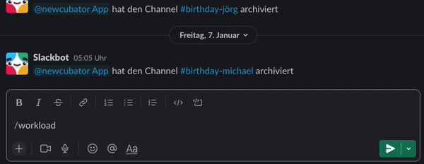
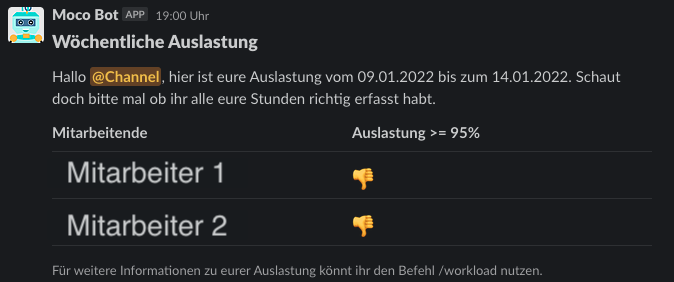

# About the Workload Bots

The workload bots are used to gain an overview over the employees tracked times for customer projects. Newcubator employees should work a
certain percentage of their time for a customer.
We have 2 different workload bots. For both you need to:

- create a [slack app](https://api.slack.com/authentication/basics)
- get the SLACK_TOKEN
- get your MOCO_TOKEN (each user can find their user-specific key on mocoapp.com on their profile in the "Integrations" tab.). For more information about the MOCO api click [here](https://github.com/hundertzehn/mocoapp-api-docs).
- add the keys to the environment variables in Gitlab (Settings > CI/CD > Variables).

## 1. workload

Can only be triggered by a slack command and returns information about your own workload.
By default, the bot displays the workload of the last 21 days. However, you have the option to limit the number of the last days behind the command.

### Additional Prerequisites

- add the workload [Slash Command](https://api.slack.com/interactivity/slash-commands) to your app

### How to use

To see your workload of the last 21 days, just type /workload in any chat.

```
/workload
```

This could look like this:



To see your workload of a specific amount of days, just add the amount of days as a number:

```
/workload <amount of days>
```

For example `/workload 4` shows your workload of the last 4 days.

## 2. workload-all

Is automatically triggered at 06:00PM (UTC) on Friday posting an overview over the workload of the week for all employees to a slack channel.
To adjust this, you can simply change the execution time of the [AWS EventBridge](https://docs.aws.amazon.com/eventbridge/) [here](https://gitlab.com/newcubator/micro-bots/-/blob/main/serverless.yml).

Only the people who have not reached the target are displayed. These are provided with a thumbs down, which then looks like this:



### Additional Prerequisites

- add the id of the channel id in which you want to post the reminder as GENERAL_CHANNEL to GitLab (Settings > CI/CD > Variables).
- add your goal workload percentage of the employees as WORKLOAD_PERCENTAGE to GitLab (Settings > CI/CD > Variables).
